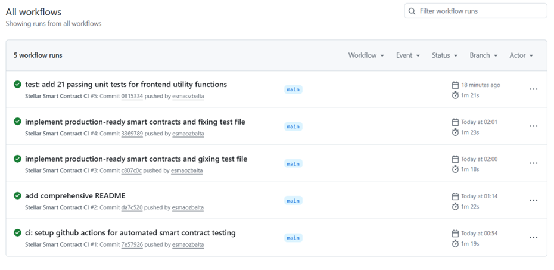
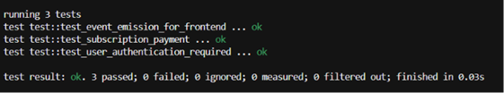
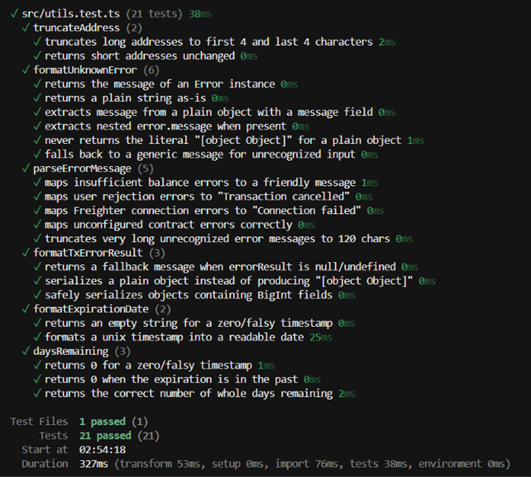

# ⬛ VAULT. | Decentralized Cloud Storage Subscription

> A mobile-first, high-fidelity Web3 subscription dApp built on the Stellar Soroban network.

Vault is a decentralized application designed to manage recurring cloud storage subscriptions using Stellar's Soroban smart contracts. Moving away from cluttered Web3 interfaces, Vault adopts a strict minimalist, architectural design philosophy—focusing on clean lines, typography, and a seamless user experience.

Under the hood, it leverages advanced Rust-based smart contract architecture, featuring secure inter-contract communication and real-time event streaming, entirely verified by automated CI/CD pipelines.

---

## 🔗 Live Deployment & On-Chain Proofs

- **Live Application:** https://stellar-subscription-dapp-ajyzxsjkp-esmas-projects-a760898d.vercel.app/
- **Video Walkthrough:** https://youtu.be/t0yeabglmi0
- **Network:** Stellar Testnet
- **SubscriptionRegistry Contract ID:** `CDKD52AJ4CS76JIUEA47H3RRHDG7NDSFN256HOY6K3EWUS5P7XJTMFH5`
- **PaymentExecutor Contract ID:** `CDGWCIPQNGLODDYCRJHA5NTGIEMYYX625HWZNDVNJMVMDNR6R6FYCKGM`
- **Example Subscription Transaction Hash:** `5c62af5d1394b80609711692d9622bbca6f64bb588bb5cbc2e5afb72c393377d`
- **Explorer Link:** [View `pay_and_extend` call on Stellar Expert](https://stellar.expert/explorer/testnet/tx/5c62af5d1394b80609711692d9622bbca6f64bb588bb5cbc2e5afb72c393377d)

> **Note:** Both contracts are deployed from the same compiled Wasm binary (the crate defines both `SubscriptionRegistry` and `PaymentExecutor` as separate `#[contract]` structs), each instantiated as its own independent on-chain contract instance with its own address and storage.

---

## 🏗️ Architecture & Technical Implementation

Vault is separated into a robust Rust backend and a modern React frontend, meeting all advanced evaluation criteria.

### 1. Smart Contracts (Soroban / Rust)

The protocol utilizes a multi-contract architecture to ensure separation of concerns:

- **SubscriptionRegistry Contract:** Acts as the decentralized database. It securely stores and extends the expiration timestamps of user subscriptions (`extend`, `get_exp`, `get_status`).
- **PaymentExecutor Contract:** Handles user authentication (`require_auth`) and acts as the payment proxy, calling into the registry once a subscription is purchased.
- **Inter-Contract Communication:** `PaymentExecutor::pay_and_extend` uses `env.invoke_contract()` to call `SubscriptionRegistry::extend` in a single transactional flow, passing the registry's contract address as a runtime parameter.
- **Event Streaming:** Critical actions emit on-chain events (`extend`, `pay_and_extend` success) so frontends can react instantly without polling.
- **Renewal Logic:** Extending an already-active subscription stacks the new period on top of the remaining time (rather than resetting it), consistent with standard subscription billing behavior.

### 2. Frontend Application (React / TypeScript)

- **Design Philosophy:** Engineered with a high-end minimalist aesthetic (black/white palette, generous whitespace, sharp typography).
- **Mobile-First:** Built entirely responsive, ensuring the dApp looks and functions flawlessly on mobile devices.
- **Freighter API Integration:** Seamless wallet connection, session restoration, and transaction signing.
- **State Management & UX:** Loading states for every async step (connecting, subscribing), on-chain transaction confirmation polling before re-reading contract state, and clean, human-readable error messages (never raw `[object Object]` output).
- **Subscription Insight:** Displays live renewal date and days remaining, read directly from the `SubscriptionRegistry` contract via `get_exp`.

### 3. DevOps & Testing (CI/CD)

- **Smart Contract Unit Testing:** 3 Rust unit tests cover initial state, registry extension, and cross-contract authorization/invocation.
- **Frontend Unit Testing:** 21 Vitest unit tests cover error formatting/parsing, address truncation, expiration date formatting, and days-remaining calculations — including regression tests that specifically guard against the `[object Object]` error display bug.
- **GitHub Actions:** A fully automated CI/CD pipeline triggers on every push to the `main` branch, compiling the WASM targets and running `cargo test` on an Ubuntu runner.

---

## ✅ Evaluation Checklist Mastered

- [x] **10+ Meaningful Commits:** Granular, descriptive Git history.
- [x] **Advanced Contracts:** Multi-contract setup.
- [x] **Inter-Contract Communication:** Demonstrated via `invoke_contract` logic.
- [x] **Event Streaming:** On-chain events published.
- [x] **Mobile-Responsive UI:** Production-grade, mobile-first frontend.
- [x] **Error & Loading States:** Graceful degradation and real-time user feedback.
- [x] **Contract Unit Tests:** 3 tests verifying contract integrity.
- [x] **Frontend Unit Tests:** 21 tests verifying utility/business logic.
- [x] **CI/CD Pipeline:** GitHub Actions workflow successfully implemented.
- [x] **On-Chain Deployment:** Testnet deployment completed with Contract IDs and Tx Hash.

---

## 📸 Screenshots

| Mobile Responsive UI | CI/CD Pipeline |
|---|---|
|  |  |

| Contract Tests (Rust) | Frontend Tests (Vitest) |
|---|---|
|  |  |

---

## 💻 Local Development Setup

To run this project locally, follow these steps:

**1. Clone the repository:**
```bash
git clone https://github.com/esmaozbalta/stellar-subscription-dapp.git
cd stellar-subscription-dapp
```

**2. Smart Contract Build & Testing:**
```bash
stellar contract build
cargo test
```

**3. Frontend Installation & Start:**
```bash
cd frontend
npm install
npm run dev
```

**4. Frontend Unit Tests:**
```bash
cd frontend
npm test
```

**5. Environment Variables**

Create a `.env` file inside `frontend/` with your deployed contract IDs:
```
VITE_PAYMENT_EXECUTOR_ID=CDGWCIPQNGLODDYCRJHA5NTGIEMYYX625HWZNDVNJMVMDNR6R6FYCKGM
VITE_REGISTRY_ID=CDKD52AJ4CS76JIUEA47H3RRHDG7NDSFN256HOY6K3EWUS5P7XJTMFH5
```
